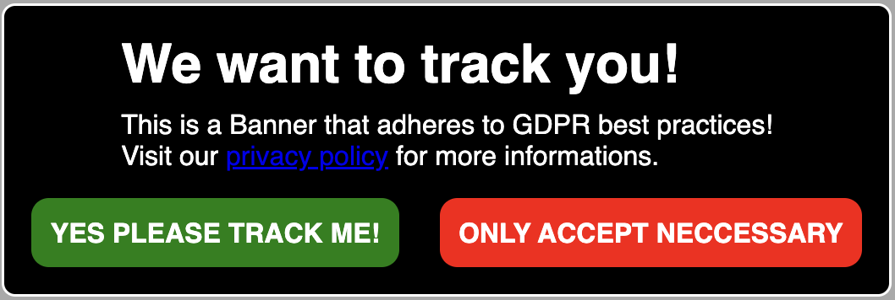

# svelte-cookie-consent

`A user friendly way to ask for consent`

I could not find a good solution for my SvelteKit project, where i could ask a user for tracking and advertising consent. So i made one.

**⚠️ THIS PROJECT IS STILL IN BETA, BUGS AND ERRORS ARE EXPECTED ⚠️**

You can install it, right from NPM

    npm i @manchtools/svelte-cookie-consent@latest

You have access to 5 exports that control the consent banner behaviour.

```
<CookieConsentBanner>       |Svelte component
<TrackingHead>			    |Svelte component
<TrackingBody>			    |Svelte component
<AdvertismentHead>			|Svelte component
<AdvertismentBody>			|Svelte component
trackingConsent			    |Svelte store
advertisingConsent			|Svelte store
cookieConsentSeen		    |Svelte store
```

## CookieConsentBanner

This is the main banner that your users sees when first loading your site.



It provides 4 named slots

```
titleText
mainText
giveConsentText
denyConsentText
```

You can insert your own text or HTML into these slots to extend it for your needs.
