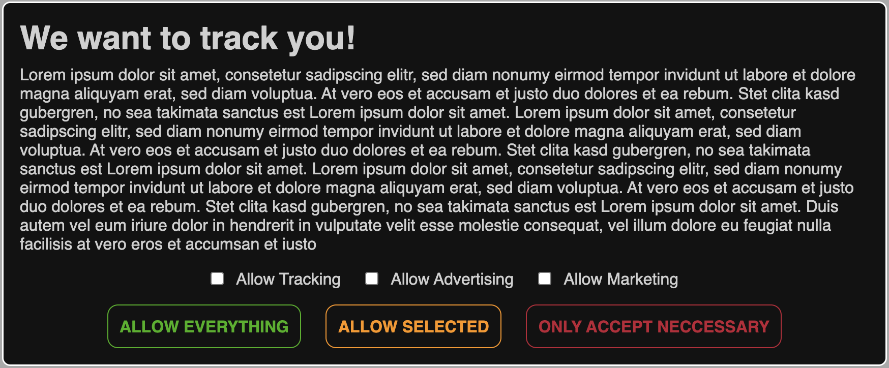
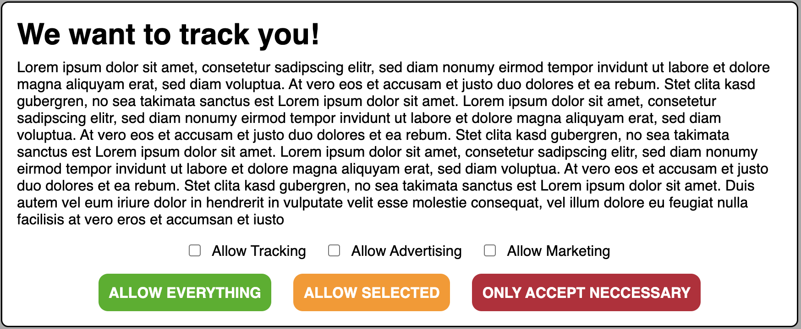
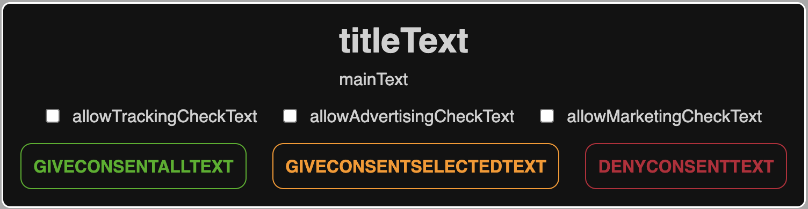
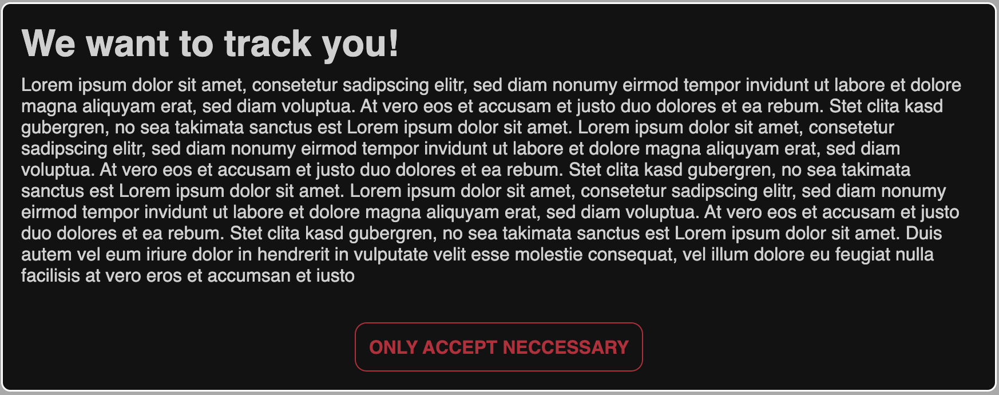

# svelte-cookie-consent

`A user friendly way to ask for consent`

I could not find a good solution for my SvelteKit project, where i could ask a user for tracking and advertising consent. So i made one.

**⚠️ THIS PROJECT IS STILL IN BETA, BUGS AND ERRORS ARE EXPECTED ⚠️**

You can install it, right from NPM

    npm i @manchtools/svelte-cookie-consent@latest

You have access to 11 exports that control the consent banner behavior.

```
<CookieConsentBanner>   | Svelte component
<TrackingHead>          | Svelte component
<TrackingBody>          | Svelte component
<AdvertismentHead>      | Svelte component
<AdvertismentBody>      | Svelte component
<MarketingHead>         | Svelte component (new in v0.2.0)
<MarketingBody>         | Svelte component (new in v0.2.0)
trackingConsent         | Svelte store
advertisingConsent      | Svelte store
marketingConsent        | Svelte Store (new in v0.2.0)
cookieConsentSeen       | Svelte store
resetCookieBanner       | function that removes all cookies and resets banner to default
```

Cookies get an expiration date of 365 days. After that time period, the user will be asked for consent again.

## CookieConsentBanner

This is the main banner that your users sees when first loading your site.

##### Dark version



#### Light version



It provides 8 named slots

```
titleText
mainText
allowTrackingCheckText
allowAdvertisingCheckText
allowMarketingCheckText
giveConsentAllText
giveConsentSelectedText
denyConsentText
```

You can insert your own text or HTML into these slots to extend it for your needs.



New in v0.2.0 are now 3 props

```
showAdvertisingOption   | Default true
showMarketingOption     | Default true
showTrackingOption      | Default true
```

Passing false to any of these props will remove them from the banner and a user wont be able to consent to that form of data collection

```
<Banner showAdvertisingOption={false} showMarketingOption={false} showTrackingOption={false}>
```

If you pass `{false}` to every prop, the user will only see the option from slot `denyConsentText`


## Styling

The banner contains the following styles as CSS root variables that can be replaced to fit your color schema.

```
--ccb-dark-color-bg: #000000;
--ccb-light-color-bg: #ffffff;
--ccb-dark-color-text: #000000;
--ccb-light-color-text: #ffffff;
--ccb-dark-color-border: #000000;
--ccb-light-color-border: #ffffff;
--ccb-allow-button: #008000;
--ccb-deny-button: #ff0000;
```

## TrackingHead and AdvertismentHead

You can place any content inside these components that needs to be inside your `<head>`.
You can place it inside your root layout, or on a page by page basis.

Content inside this component, only gets injected once the user has given consent.

## TrackingBody and AdvertismentBody

You can place any content inside these components that needs to be inside your `<body>`.
You can place it inside your root layout, or on a page by page basis.
It will be inserted like a normal component so order matters.

Content inside this component only gets injected once the user has given consent.

## trackingConsent and advertisingConsent

These stores contain the user selection as a boolean value.
You can use them inside your JavaScript/TypeScript to dynamically have access to user consents, or build your own custom components.

## cookieConsentSeen

This store is just for triggering the CookieConsentBanner.
If value is false, banner will get displayed, else banner won't be shown.

## Cookies that get set on client

The following cookies get set in the client Browser, after the user has interacted with the cookie consent banner.

```
tracking-cookie-consent         | Default false
advertising-cookie-consent      | Default false
cookie-banner-seen              | Default false
```

# Legal disclaimer

This tool tries to adhere to GDPR best practices. We are not responsible for any legal liability you may encounter whilst using this tool. You are fully responsible for checking all legal repercussions before implementing this tool
